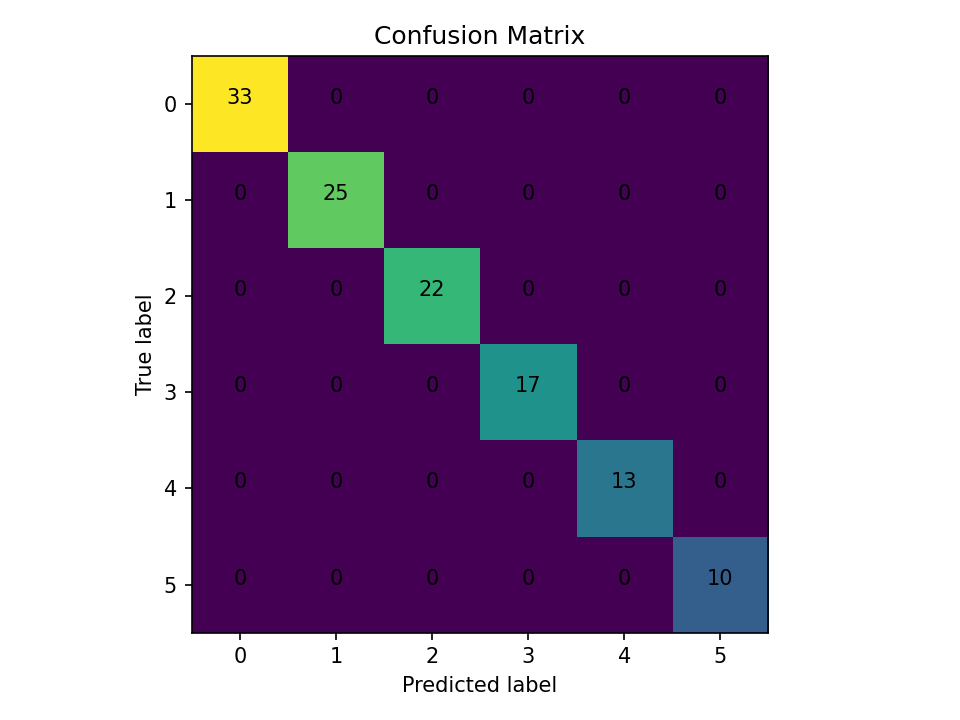

# 🚀 Quickstart (Toy Data)
Reproduce the pipeline **without downloading TCGA** using a tiny synthetic dataset.

```bash
# create and activate env (example)
python -m venv .venv && . .venv/bin/activate  # Windows: .venv\Scripts\activate
pip install -r requirements-dev.txt

# run end-to-end on toy data
make run-toy
```

## What this adds
- `data/synthetic/` generator for a **toy multi-omic dataset**
- `Makefile` with reproducible targets (`env`, `data`, `train`, `eval`)
- Minimal `tests/` and GitHub Actions CI
- `MODEL_CARD.md` documenting task, metrics, and limitations
- README embeds for **confusion matrix** and **ROC/AUC** (ensure your training code saves the figures into `figures/`)

> After verifying toy run, switch your config back to the real dataset for proper results.

## Results (Toy Run)

The toy pipeline produces a confusion matrix:



> Reproduce locally
> ```bash
> python -m venv .venv && . .venv/Scripts/activate
> pip install -r requirements-dev.txt
> python scripts/generate_synthetic_multiomic.py --out data/synthetic --n 600 --omics rna,proteomics,cnv --classes 6 --imbalance 0.2
> python scripts/train_classifier.py --data_dir data/synthetic --out_dir artifacts/toy
> python scripts/evaluate_classifier.py --artifact_dir artifacts/toy --fig_dir figures
> ```
